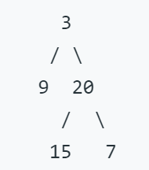

# 104. 二叉树的最大深度

给定一个二叉树，找出其最大深度。
二叉树的深度为根节点到最远叶子节点的最长路径上的节点数。

示例：  

### 输入1:   
  

### 输出1:  
```Python
3
```

### 解答：  

```Python
def maxDepth(self, root: TreeNode) -> int:
    if root is None: return 0
    leftDepth = self.maxDepth(root.left)
    rightDepth = self.maxDepth(root.right)
    return 1+leftDepth if leftDepth>=rightDepth else 1+rightDepth
```
